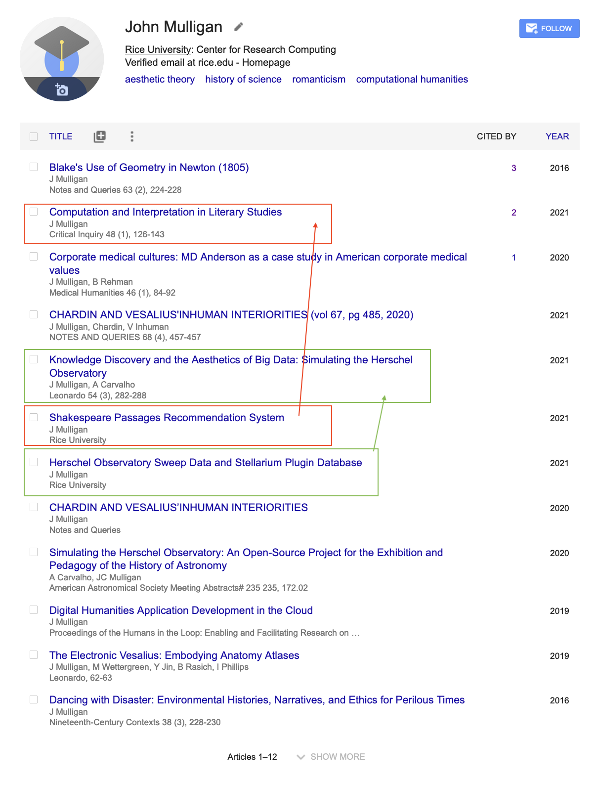
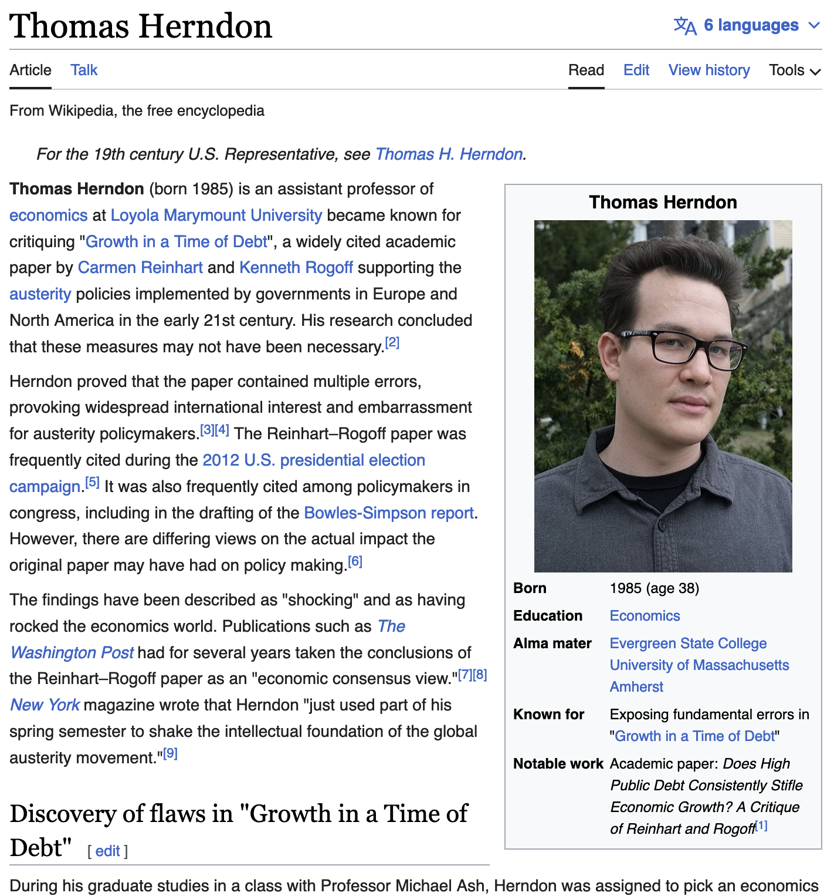
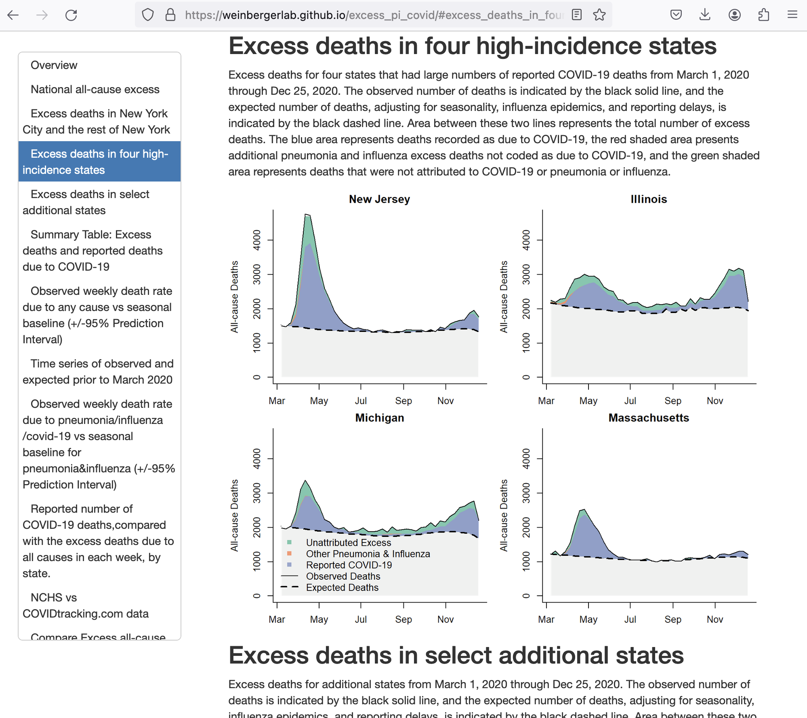
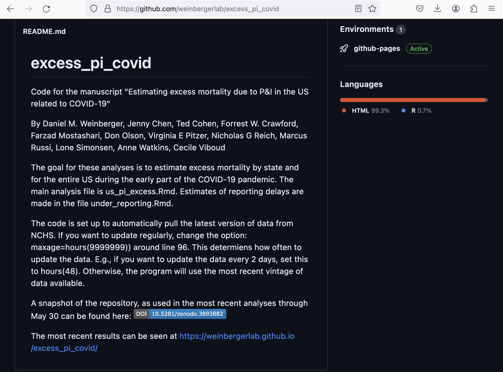
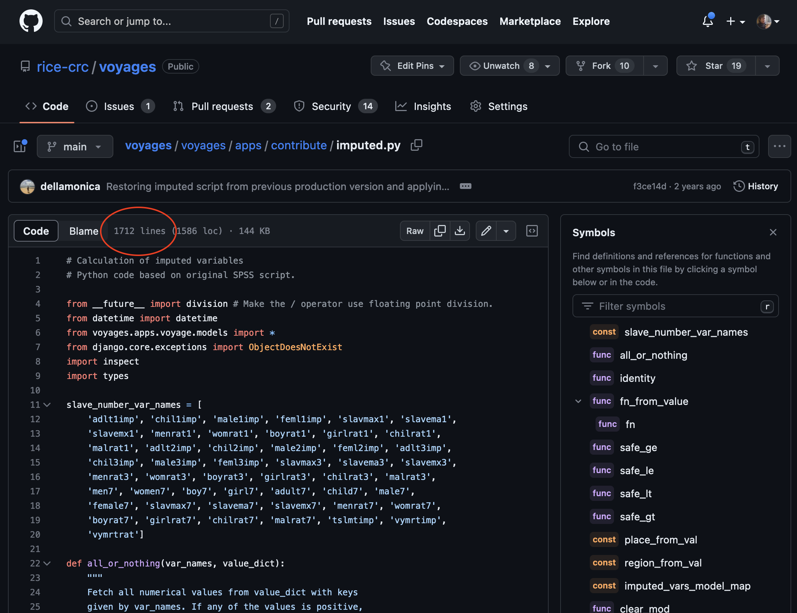

::::::::::::::::::::::::::::::::::::::: objectives

- Explain how a version control system can be leveraged as an electronic lab notebook for computational work.

::::::::::::::::::::::::::::::::::::::::::::::::::

:::::::::::::::::::::::::::::::::::::::: questions

- How can version control help me make my work more open?

::::::::::::::::::::::::::::::::::::::::::::::::::

> The opposite of "open" isn't "closed".
> The opposite of "open" is "broken".
> 
> \--- John Wilbanks

Free sharing of information might be the ideal in science,
but the reality is often more complicated.
Normal practice today looks something like this:

- A scientist collects some data and stores it on a machine
  that is occasionally backed up by their department.
- They then write or modify a few small programs
  (which also reside on the machine)
  to analyze that data.
- Once they have some results,
  they write them up and submit a paper.
  The scientist might include their data -- a growing number of journals require this -- but
  they probably don't include the code.
- Time passes.
- The journal sends the scientist reviews written anonymously by a handful of other people in their field.
  The scientist revises the paper to satisfy the reviewers,
  during which time they might also modify the scripts they wrote earlier,
  and resubmits.
- More time passes.
- The paper is eventually published.
  It might include a link to an online copy of the data,
  but the paper itself will be behind a paywall:
  only people who have personal or institutional access
  will be able to read it.

For a growing number of scientists,
though,
the process looks like this:

- The data that the scientist collects is stored in an open access repository
  like [figshare](https://figshare.com/) or
  [Zenodo](https://zenodo.org), possibly as soon as it's collected,
  and given its own
  [Digital Object Identifier](https://en.wikipedia.org/wiki/Digital_object_identifier) (DOI).
  Or the data was already published and is stored in
  [Dryad](https://datadryad.org/).
- The scientist creates a new repository on GitHub to hold their work.
- During analysis,
  they push changes to their scripts
  (and possibly some output files)
  to that repository.
  The scientist also uses the repository for their paper;
  that repository is then the hub for collaboration with colleagues.
- When they are happy with the state of the paper,
  the scientist posts a version to [arXiv](https://arxiv.org/)
  or some other preprint server
  to invite feedback from peers.
- Based on that feedback,
  they may post several revisions
  before finally submitting the paper to a journal.
- The published paper includes links to the preprint
  and to the code and data repositories,
  which  makes it much easier for other scientists
  to use their work as starting point for their own research.

This open model accelerates discovery:
the more open work is,
[the more widely it is cited and re-used](https://doi.org/10.1371/journal.pone.0000308).
However,
people who want to work this way need to make some decisions
about what exactly "open" means and how to do it. You can find more on the different aspects of Open Science in [this book](https://link.springer.com/book/10.1007/978-3-319-00026-8).

:::::::::::::::::::::::::::::::::::::::::  callout

Rice has a top-notch data repository service! And we work with the people who run it.

Why would you want this? Not just because it's nice for others, but because it's good for you, too!

Your article gets a DOI, but so does your dataset -- and search engines index both!

::::::::::::::::::::::::::::::::::::::::::::::::::

This is one of the (many) reasons we teach version control.
When used diligently,
it answers the "how" question
by acting as a shareable electronic lab notebook for computational work:

- The conceptual stages of your work are documented, including who did
  what and when. Every step is stamped with an identifier (the commit ID)
  that is for most intents and purposes unique.
- You can tie documentation of rationale, ideas, and other
  intellectual work directly to the changes that spring from them.
- You can refer to what you used in your research to obtain your
  computational results in a way that is unique and recoverable.
- With a version control system such as Git,
  the entire history of the repository is easy to archive for perpetuity.

:::::::::::::::::::::::::::::::::::::::::  callout

## Making Code Citable

Anything that is hosted in a version control repository (data, code, papers,
etc.) can be turned into a citable object. You'll learn how to do this in
[the later episode on Citation](12-citation.md).

::::::::::::::::::::::::::::::::::::::::::::::::::

## Reproducibility

Why do we want to make research methods and results open and testable? For the same reason that we want to publish our results! In order to have them tested further, because:

1. We're not always right: You want to help people check your work.
1. We never get the final word: You want to help people pick up where you left off.

### Example: Thomas Herndon

Whoops! Sorry we got lazy in Excel and melted the global economy.

### Example: The Weinberger Lab

You're welcome for a beautiful methods breakdown on a very difficult modeling question.

### Future work! The SlaveVoyages Impute Algorithms :)

SPSS --> Jupyter Notebooks?

I'm taking volunteers ... jcm10@rice.edu ... no, seriously.

